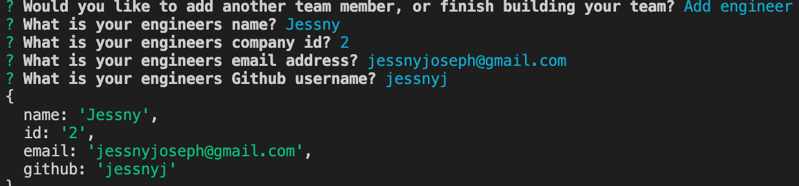

# profile-generator
 

## Table of Contents
* [Title](#title)
* [Demo](#demo)
* [Technologies Used](#technologies-used)
* [Description](#description)
* [Work Involved](#work-involved)
* [Code Snippet](#code-snippet)
* [Usage](#usage)
* [License](#license)
* [Authors](#authors)
* [Questions](#questions)
* [Acknowledgments](#acknowledgments)

## Demo
Please check out a demo of this application here.
[Demo](https://drive.google.com/file/d/1JHsCq0hlwEHyoYh7O2OduTIXa8kHjzez/view)

## Technologies Used
* javascript
* NodeJS
* Jest
* Inquirer

## Description
This application takes in information about employees and generates an HTML webpage that displays information about each employee. The employee types include managers, interns, and engineers, and for each employee you can upload their name, email, employee id, and more. 

## Work Involved
For this application, I utilized Inquirer in order to generate a prompt for the user to input information about the employees. The answers that the user added are then passed into a newly generated HTML file with all of the employee information displayed. 

## Code Snippet
```
const managerPrompt = () => {
    return inquirer.prompt([
        {
            type: 'input',
            name: 'name',
            message: 'What is your team managers name?',
        },
        {
            type: 'input',
            name: 'email',
            message: 'What is your team managers email address?',
        },
```
```
 .then(answers => {
            console.log(answers);
            const teamMember = new Manager(answers.name, answers.email, answers.id, answers.officeNumber);
            teamArray.push(teamMember);
            newTeamMember();
        });
```
```
function fullTeam() {
    fs.writeFile(outputPath, render(teamArray), (err) =>
    (err) ? console.error(err) : console.log('Your team is complete!!')
);
}
```

## Usage


## License
This project is covered under MIT.

## Authors
**UC Berkeley Coding Bootcamp**

**Jessny Joseph** 

## Questions 
* [Github](https://github.com/jessnyj)
* [LinkedIn](https://www.linkedin.com/in/jessny-joseph-361515201)

## Acknowledgments
Trilogy Education Services